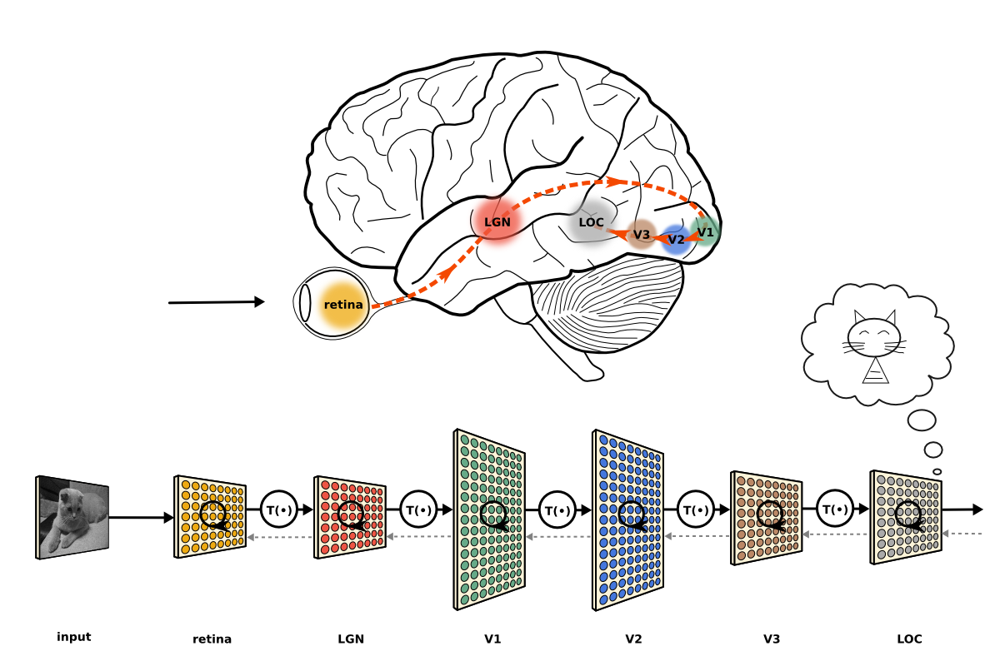

layout: true

<div class="my-footer">
  <span style="text-align:center">
    <span> 
      
    </span>
    <a href="https://cdsbasel.github.io/neuralnetworks/">
      <span style="padding-left:82px"> 
        <font color="#7E7E7E">
          cdsbasel.github.io/neuralnetworks/
        </font>
      </span>
    </a>
    <a href="https://cdsbasel.github.io/neuralnetworks/">
      <font color="#7E7E7E">
       Introduction to Neural Networks | May 2020
      </font>
    </a>
    </span>
  </div> 

---


```{r setup, include=FALSE}
options(htmltools.dir.version = FALSE)
# see: https://github.com/yihui/xaringan
# install.packages("xaringan")
# see: 
# https://github.com/yihui/xaringan/wiki
# https://github.com/gnab/remark/wiki/Markdown
options(width=110)
options(digits = 4)

# Get color palette functions

source("https://raw.githubusercontent.com/therbootcamp/ML_2019Oct/master/_materials/code/baselrbootcamp_palettes.R")
```


```{r, echo = FALSE ,message = FALSE, warning = FALSE}
library(tidyverse)
library(keras)


```

.pull-left3[

# Neural processing in the brain

<ul>
  <li class="m1"><span>Deep feedforward networks have <high>"many" hidden layers</high>.</span></li>
  <li class="m2"><span>The hidden layers learn <high>useful representations of the inputs</high>.</span></li>
  <li class="m3"><span>The deeper the layer, the <high>more abstract the representation</high>.</span></li>
  <li class="m4"><span>Useful does <high>not mean intuitive</high>.</span></li>
</ul>

]


.pull-right6[

<br><br>

<p align = "center">
<br>
<font style="font-size:10px">from <a href="https://neuwritesd.org/2015/10/22/deep-neural-networks-help-us-read-your-mind/">neuwritesd.org</a>, see <a href="https://www.pnas.org/content/111/23/8619">this</a></font>
</p>

]


---

.pull-left3[

# Semantic space

<ul>
  <li class="m1"><span>Deep feedforward networks have <high>"many" hidden layers</high>.</span></li>
  <li class="m2"><span>The hidden layers learn <high>useful representations of the inputs</high>.</span></li>
  <li class="m3"><span>The deeper the layer, the <high>more abstract the representation</high>.</span></li>
  <li class="m4"><span>Useful does <high>not mean intuitive</high>.</span></li>
</ul>

]


.pull-right6[

<br><br>

<p align = "center">
<br>
<font style="font-size:10px">from <a href="https://neuwritesd.org/2015/10/22/deep-neural-networks-help-us-read-your-mind/">neuwritesd.org</a>, see <a href="https://www.pnas.org/content/111/23/8619">this</a></font>
</p>

]


---

class: middle, center

<h1><a href=https://cdsbasel.github.io/dataanalytics/menu/materials.html>Materials</a></h1>


